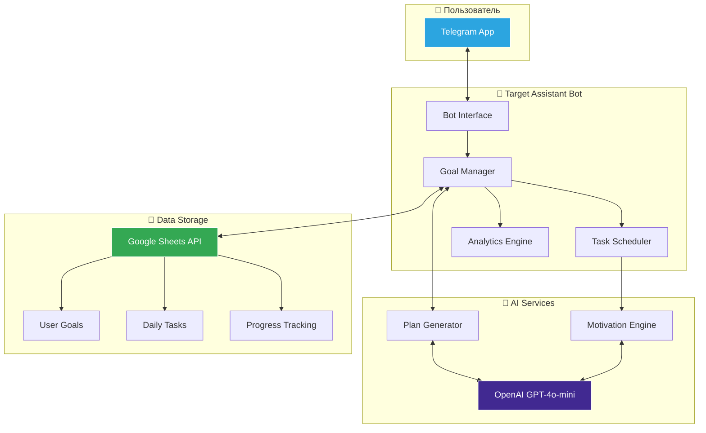
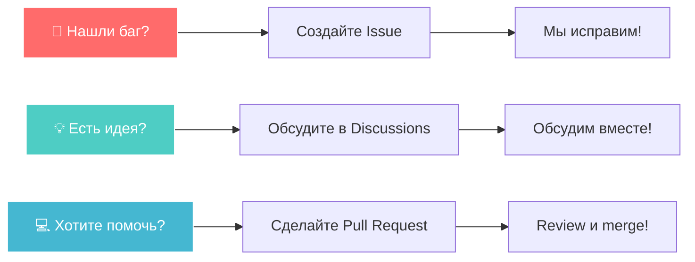

<div align="center">
  
  
  <h1>🎯 Target Assistant Bot</h1>
  
  <p>
    <strong>Ваш персональный AI-ассистент для достижения любых целей</strong><br>
    <sub>Умный помощник, который разбивает большие цели на ежедневные задачи и следит за прогрессом</sub>
  </p>

  <p>
    <a href="README_EN.md">🌐 English Version</a> •
    <a href="#-ключевые-возможности">✨ Возможности</a> •
    <a href="#-быстрый-старт">🚀 Быстрый старт</a> •
    <a href="#-документация">📖 Документация</a>
  </p>

  <!-- Основные бейджи -->
  <p>
    <a href="https://github.com/bivlked/target-assistant-bot/releases/latest">
      
    </a>
    <a href="https://github.com/bivlked/target-assistant-bot/actions/workflows/tests.yml">
      
    </a>
    <a href="https://codecov.io/gh/bivlked/target-assistant-bot">
      
    </a>
    <a href="https://github.com/bivlked/target-assistant-bot/blob/main/LICENSE">
      
    </a>
  </p>
  <!-- Технологии -->
  <p>
    
    
    
    
    
  </p>
  <!-- Дополнительные бейджи -->
  <p>
    <a href="https://github.com/psf/black">
      
    </a>
    <a href="https://github.com/charliermarsh/ruff">
      
    </a>
    <a href="https://mypy-lang.org/">
      
    </a>
    <a href="https://github.com/bivlked/target-assistant-bot/commits/main">
      
    </a>
    <a href="https://github.com/bivlked/target-assistant-bot/issues">
      
    </a>
  </p>
</div>

---

<div align="center">
  <table>
    <tr>
      <td align="center" width="33%">
        🚀
        <br>
        <strong>Мгновенный старт</strong>
        <br>
        <sub>Начните достигать целей через 5 минут</sub>
      </td>
      <td align="center" width="33%">
        🧠
        <br>
        <strong>Умный AI-планировщик</strong>
        <br>
        <sub>GPT-4o-mini создает оптимальные планы</sub>
      </td>
      <td align="center" width="33%">
        📈
        <br>
        <strong>Отслеживание прогресса</strong>
        <br>
        <sub>Визуализация в Google Sheets</sub>
      </td>
    </tr>
  </table>
</div>

## 🌟 Ключевые возможности

### 🎯 Управление множественными целями
- **До 10 активных целей** одновременно
- **Приоритеты**: 🔴 Высокий • 🟡 Средний • 🟢 Низкий
- **Теги** для группировки: #работа #здоровье #саморазвитие
- **Статусы**: ✅ Активная • 🏆 Завершенная • 📦 В архиве

### 🤖 AI-планирование с GPT-4o-mini
- Автоматическое создание **SMART-планов**
- Разбивка на **ежедневные задачи**
- Учет вашего **расписания и возможностей**
- **Умная генерация** планов с учетом целей

### 📊 Аналитика и отчеты
- **Реальный прогресс** по каждой цели
- **Статистика выполнения** задач
- **Детальная аналитика** в Google Sheets
- **Экспорт в Google Sheets**

### 💬 Удобный интерфейс
- **Inline-кнопки** для быстрых действий
- **Пошаговый wizard** создания целей
- **Настраиваемые напоминания** (через переменные окружения)
- **Мотивационные сообщения** от AI

## 📊 Архитектура системы



## 🚀 Быстрый старт

### 🐳 Запуск через Docker (рекомендуется)

```bash
# 1. Клонируйте репозиторий
git clone https://github.com/bivlked/target-assistant-bot.git
cd target-assistant-bot

# 2. Создайте файл с настройками
cp .env.example .env

# 3. Заполните обязательные параметры в .env:
# - TELEGRAM_BOT_TOKEN (получите у @BotFather)
# - OPENAI_API_KEY (получите на platform.openai.com)
# - Добавьте google_credentials.json

# 4. Запустите бота
docker compose up -d
```

### 🐍 Локальная установка

<details>
<summary>Развернуть инструкцию</summary>

```bash
# 1. Создайте виртуальное окружение
python3 -m venv .venv
source .venv/bin/activate  # Linux/Mac
# или
.venv\Scripts\activate  # Windows

# 2. Установите зависимости
pip install -r requirements.txt

# 3. Настройте переменные окружения
cp .env.example .env
# Отредактируйте .env файл

# 4. Запустите бота
python main.py
```

</details>

### ☁️ Деплой на сервер

<details>
<summary>Развернуть инструкцию для Ubuntu/Debian</summary>

```bash
# 1. Установите зависимости
sudo apt update && sudo apt install -y python3.11 python3.11-venv git

# 2. Создайте пользователя для бота
sudo useradd -m -s /bin/bash targetbot
sudo -u targetbot -i

# 3. Клонируйте и настройте
git clone https://github.com/bivlked/target-assistant-bot.git
cd target-assistant-bot
python3.11 -m venv .venv
source .venv/bin/activate
pip install -r requirements.txt

# 4. Настройте systemd сервис
sudo cp deploy/targetbot.service /etc/systemd/system/
sudo systemctl enable --now targetbot
```

Подробная инструкция: [📖 Установка на Ubuntu](docs/install_ubuntu_detailed.md)

</details>

## 📖 Примеры использования

### 🎯 Создание первой цели

```
👤: /start
🤖: Добро пожаловать в Target Assistant Bot! 🎯
    
    Я помогу вам достигать любых целей, разбивая их на 
    конкретные ежедневные задачи.
    
    [🎯 Мои цели] [➕ Создать цель] [📊 Открыть таблицу]

👤: [Нажимает ➕ Создать цель]
🤖: Шаг 1/6: Введите название цели
    Например: "Изучить Python", "Похудеть на 10 кг"

👤: Выучить английский до уровня B2
🤖: Шаг 2/6: Опишите подробнее, чего хотите достичь?

... [пошаговый процесс создания] ...

🤖: ✅ Цель создана! Я составил план на 90 дней.
    Первая задача на завтра:
    📝 Пройти тест на определение текущего уровня
```

### 📅 Ежедневная работа

```
🤖: ☀️ Доброе утро! Ваши задачи на сегодня:

📚 Английский язык (🔴 высокий приоритет)
└─ Выучить 20 новых слов по теме "Бизнес"

🏃 Здоровье (🟡 средний приоритет)  
└─ Пробежка 3 км в парке

💻 Программирование (🟢 низкий приоритет)
└─ Прочитать главу про ООП в Python

[✅ Отметить выполнение] [📊 Статистика]
```

## 📋 Полный список команд

| Команда | Описание | Пример |
|---------|----------|--------|
| `/start` | 🚀 Начало работы с ботом | `/start` |
| `/my_goals` | 🎯 Управление всеми целями | `/my_goals` |
| `/add_goal` | ➕ Создать новую цель | `/add_goal` |
| `/today` | 📅 Задачи на сегодня | `/today` |
| `/check` | ✅ Отметить выполнение | `/check` |
| `/status` | 📊 Общая статистика | `/status` |
| `/motivation` | 💪 Получить мотивацию | `/motivation` |
| `/help` | ❓ Справка по командам | `/help` |
| `/reset` | 🗑️ Удалить все данные | `/reset` |

## 🛠️ Технологический стек

<div align="center">
  <table>
    <tr>
      <th>Категория</th>
      <th>Технологии</th>
    </tr>
    <tr>
      <td><strong>🐍 Язык</strong></td>
      <td>Python 3.12+ с полной типизацией</td>
    </tr>
    <tr>
      <td><strong>🤖 Telegram</strong></td>
      <td>python-telegram-bot 22.0 (async)</td>
    </tr>
    <tr>
      <td><strong>🧠 AI</strong></td>
      <td>OpenAI GPT-4o-mini API</td>
    </tr>
    <tr>
      <td><strong>💾 Хранение</strong></td>
      <td>Google Sheets API v4</td>
    </tr>
    <tr>
      <td><strong>🔄 Асинхронность</strong></td>
      <td>asyncio</td>
    </tr>
    <tr>
      <td><strong>⏰ Планировщик</strong></td>
      <td>APScheduler</td>
    </tr>
    <tr>
      <td><strong>🧪 Тестирование</strong></td>
      <td>pytest, pytest-asyncio, coverage</td>
    </tr>
    <tr>
      <td><strong>📊 Мониторинг</strong></td>
      <td>Prometheus, Sentry</td>
    </tr>
    <tr>
      <td><strong>🐳 Контейнеризация</strong></td>
      <td>Docker, Docker Compose</td>
    </tr>
    <tr>
      <td><strong>🔧 CI/CD</strong></td>
      <td>GitHub Actions</td>
    </tr>
  </table>
</div>

## 📚 Документация

### 📖 Для пользователей
- [**Руководство пользователя**](docs/user_guide.md) - подробная инструкция по использованию
- [**FAQ**](docs/faq.md) - ответы на частые вопросы
- [**Примеры целей**](docs/examples.md) - идеи и шаблоны целей

### 🛠️ Для разработчиков
- [**Архитектура проекта**](docs/architecture.md) - техническое описание
- [**API документация**](https://bivlked.github.io/target-assistant-bot/) - автогенерируемая документация
- [**Руководство контрибьютора**](CONTRIBUTING.md) - как внести свой вклад
- [**Чек-лист разработки**](DEVELOPMENT_CHECKLIST.md) - roadmap и задачи

### 🚀 Установка и настройка
- [**Быстрая установка**](docs/install_ubuntu.md) - краткая инструкция
- [**Подробная установка**](docs/install_ubuntu_detailed.md) - пошаговое руководство
- [**Настройка Google Sheets**](docs/google_sheets_setup.md) - создание service account
- [**Переменные окружения**](.env.example) - описание всех параметров

## 🤝 Как внести свой вклад

Мы рады любому вкладу в развитие проекта! 



Прочитайте [CONTRIBUTING.md](CONTRIBUTING.md) для подробной информации.

## 📈 Статистика проекта

<div align="center">
  
</div>

## 🏆 Контрибьюторы

<a href="https://github.com/bivlked/target-assistant-bot/graphs/contributors">
  
</a>

## 📜 Лицензия

Этот проект распространяется под лицензией MIT. Подробности в файле [LICENSE](LICENSE).

---

<div align="center">
  
### ⭐ Поддержите проект

Если Target Assistant Bot помог вам в достижении целей, поставьте звезду!

[](https://star-history.com/#bivlked/target-assistant-bot&Date)

<br>

**Сделано с ❤️ by [bivlked](https://github.com/bivlked)**

<sub>
  Есть вопросы? Создайте <a href="https://github.com/bivlked/target-assistant-bot/issues/new">Issue</a> • 
  Хотите обсудить? Заходите в <a href="https://github.com/bivlked/target-assistant-bot/discussions">Discussions</a> •
  Нужна помощь? Пишите в <a href="https://t.me/targetassistant_support">Telegram</a>
</sub>

</div> 
