# 🎯 Target Assistant Bot

[](https://github.com/bivlked/target-assistant-bot/actions/workflows/ci.yml)
[](https://github.com/bivlked/target-assistant-bot/actions/workflows/tests.yml)
[](https://codecov.io/gh/bivlked/target-assistant-bot)
[](https://www.python.org/downloads/)
[](https://github.com/psf/black)
[](https://conventionalcommits.org)
[](https://opensource.org/licenses/MIT)
[](https://github.com/bivlked/target-assistant-bot/releases/latest)

> [🌍 Русский](README.md) • [📚 Documentation](docs/source/index.rst) • [🔄 Changelog](CHANGELOG.md)

**Your personal Telegram assistant for achieving goals with intelligent planning and progress tracking via Google Sheets. Now supports up to 10 simultaneous goals!**

<div align="center">
  <table>
    <tr>
      <td align="center"><strong>🚀 Project Goal</strong></td>
      <td>Create an intelligent and responsive assistant for effective progress towards long-term goals</td>
    </tr>
    <tr>
      <td align="center"><strong>🎯 Key Technologies</strong></td>
      <td>Python • python-telegram-bot • OpenAI API • Google Sheets API</td>
    </tr>
    <tr>
      <td align="center"><strong>📊 Status</strong></td>
      <td>v0.2.1 - Production Ready with Multi-Goals Support</td>
    </tr>
    <tr>
      <td align="center"><strong>📄 Presentation</strong></td>
      <td><a href="Персональный%20ассистент%20для%20помощи%20в%20достижении%20поставленных%20целей.pdf">Full Project Presentation (PDF, RU)</a></td>
    </tr>
  </table>
</div>

---

## ✨ New Features in v0.2.1

### 🎯 Multiple Goals Support
- **Up to 10 active goals simultaneously** - no more single-goal limitations
- **Goal priorities** - High 🔴, Medium 🟡, Low 🟢 for better organization  
- **Tagging system** - group goals by categories (work, health, self-development)
- **Goal statuses** - active, completed, archived goals

### 📊 Enhanced Analytics
- **Overall statistics** across all goals with detailed progress
- **Individual statistics** for each goal
- **Completion percentage** and progress dynamics
- **Time estimation** until goal completion

### 🎨 Interactive Interface
- **`/my_goals` command** with complete goal management
- **Interactive buttons** for creating, editing, completing goals
- **Goal creation wizard** with step-by-step guidance
- **Inline keyboards** for all operations

### 🏗️ Improved Architecture
- **Dependency injection** instead of GoalManager singleton
- **Multi-sheet Google Sheets** structure (one sheet per goal)
- **Automatic data migration** from legacy format
- **Enhanced error handling** and logging

---

## 🎯 Key Features

### 🤖 Intelligent Goal Setting
- **Natural language processing** - describe your goal in your own words
- **Smart deadline parsing** - supports flexible time formats
- **Personalized daily planning** - AI generates optimal task sequences
- **Adaptive scheduling** - adjusts based on your progress and lifestyle

### 📊 Advanced Progress Tracking
- **Real-time progress monitoring** across all goals
- **Smart notifications** for daily tasks and milestones
- **Detailed analytics** with completion rates and predictions
- **Visual progress indicators** with emoji and percentages

### 🔄 Seamless Integration
- **Google Sheets synchronization** - all data automatically saved
- **Multi-device access** - work from anywhere with internet
- **Backup and export** - your data is always accessible
- **Privacy-focused** - data stored in your personal Google account

### 🎨 User Experience
- **Intuitive interface** with inline keyboards and buttons
- **Multi-language support** - Russian interface with English documentation
- **Mobile-optimized** - perfect for daily use on smartphones
- **Zero-configuration** - works out of the box after setup

---

## 🚀 Quick Start

### Prerequisites
- Python 3.10+
- Telegram Bot Token (from [@BotFather](https://t.me/BotFather))
- OpenAI API Key
- Google Cloud Project with Sheets API enabled

### 🐳 Docker (Recommended)

```bash
# Clone repository
git clone https://github.com/bivlked/target-assistant-bot.git
cd target-assistant-bot

# Copy and configure environment
cp env.example .env
# Edit .env with your tokens and credentials

# Setup Google Sheets credentials
cp dummy_credentials.json google_credentials.json
# Replace with your actual Google Cloud credentials

# Run with Docker
docker-compose up -d
```

### 📦 Manual Installation

```bash
# Clone and setup
git clone https://github.com/bivlked/target-assistant-bot.git
cd target-assistant-bot

# Create virtual environment
python -m venv .venv
source .venv/bin/activate  # On Windows: .venv\Scripts\activate

# Install dependencies
pip install -r requirements.txt

# Configure environment
cp env.example .env
# Edit .env with your credentials

# Setup bot commands
python setup_commands.py

# Run bot
python main.py
```

---

## 📋 Available Commands

| Command | Description | Usage Example |
|---------|-------------|---------------|
| `/start` | Initialize bot and create spreadsheet | Start working with bot |
| `/my_goals` | **Main command** - manage all goals | Complete goal management interface |
| `/add_goal` | Create new goal interactively | Step-by-step goal creation |
| `/setgoal` | Create goal through conversation | Legacy goal creation method |
| `/today` | View all daily tasks across goals | See today's agenda |
| `/status` | Overall progress across all goals | Get comprehensive statistics |
| `/check` | Mark task completion | Update progress |
| `/motivation` | Get motivational message | Boost your motivation |
| `/reset` | Reset all data and goals | Complete data cleanup |

---

## 🏗️ Architecture Overview

### 🧩 Core Components

```mermaid
graph TB
    User[👤 User] --> TG[📱 Telegram Bot]
    TG --> DI[🔧 Dependency Injection]
    DI --> Storage[📊 Async Storage]
    DI --> LLM[🤖 OpenAI Client]
    Storage --> Sheets[📋 Google Sheets]
    LLM --> AI[🧠 GPT-4]
    
    subgraph "Multi-Goal Support"
        Storage --> Goals[🎯 Goals Manager]
        Goals --> G1[Goal 1]
        Goals --> G2[Goal 2]
        Goals --> GN[Goal N]
    end
```



### 📊 Data Flow

1. **Goal Creation** → AI generates personalized plan → Saved to dedicated sheet
2. **Daily Tasks** → Retrieved from all active goals → Presented with priorities
3. **Progress Updates** → Real-time synchronization → Analytics calculation
4. **Notifications** → Smart scheduling → Motivation and reminders

---

## 🛠️ Configuration

### Environment Variables

| Variable | Description | Required | Example |
|----------|-------------|----------|---------|
| `TELEGRAM_BOT_TOKEN` | Telegram bot token from BotFather | ✅ | `123456:ABC-DEF...` |
| `OPENAI_API_KEY` | OpenAI API key for AI features | ✅ | `sk-...` |
| `GOOGLE_CREDENTIALS_PATH` | Path to Google Cloud credentials | ✅ | `./google_credentials.json` |
| `SENTRY_DSN` | Sentry DSN for error tracking | ❌ | `https://...` |
| `PROMETHEUS_PORT` | Port for metrics server | ❌ | `8000` |

### Google Sheets Setup

1. Create a [Google Cloud Project](https://console.cloud.google.com/)
2. Enable the Google Sheets API
3. Create a Service Account and download credentials
4. Share your spreadsheet with the service account email

---

## 🧪 Testing

```bash
# Run all tests
pytest

# Run with coverage
pytest --cov=. --cov-report=html

# Run specific test categories
pytest tests/test_multi_goals.py -v
pytest tests/test_basic_imports.py -v
```

**Current Test Coverage: 89%** ✅

---

## 📈 Monitoring & Metrics

### Prometheus Metrics
- **User commands** - track most popular features
- **API calls** - monitor OpenAI and Google Sheets usage
- **Goal statistics** - completion rates and user engagement
- **System health** - response times and error rates

### Logging
- **Structured logging** with contextual information
- **Error tracking** via Sentry integration
- **Performance monitoring** for optimization
- **User behavior analytics** for feature improvement

---

## 🤝 Contributing

We welcome contributions! Please see our [Contributing Guide](CONTRIBUTING.md) for details.

### Development Workflow
1. Fork the repository
2. Create a feature branch (`git checkout -b feature/amazing-feature`)
3. Make your changes with tests
4. Ensure all tests pass (`pytest`)
5. Follow code style guidelines (`black`, `ruff`)
6. Submit a Pull Request

### Code Quality Standards
- **Black** code formatting
- **Ruff** linting and style checks
- **MyPy** type checking
- **Pytest** for testing with 80%+ coverage
- **Conventional Commits** for commit messages

---

## 📚 Documentation & Resources

### 📖 Documentation
* [API Documentation](docs/source/api/)
* [Architecture Guide](docs/source/architecture.md)
* [Deployment Guide](docs/source/deployment.md)
* [Development Checklist](DEVELOPMENT_CHECKLIST.md)

### 🔗 External Links
* [Project Presentation (PDF)](Персональный%20ассистент%20для%20помощи%20в%20достижении%20поставленных%20целей.pdf)
* [Telegram Bot API Documentation](https://core.telegram.org/bots/api)
* [OpenAI API Documentation](https://platform.openai.com/docs)
* [Google Sheets API Documentation](https://developers.google.com/sheets/api)

### 📝 Related Files
* [Changelog](CHANGELOG.md) - detailed version history
* [Contributing Guidelines](CONTRIBUTING.md) - how to contribute
* [License](LICENSE) - MIT License terms

---

## 📄 License

This project is licensed under the MIT License - see the [LICENSE](LICENSE) file for details.

---

## 🌟 Support the Project

If you find this project helpful:
- ⭐ **Star** the repository
- 🐛 **Report** bugs and suggest features
- 🤝 **Contribute** code or documentation
- 📢 **Share** with others who might benefit

---

<div align="center">
  <p>Made with ❤️ by <a href="https://github.com/bivlked">bivlked</a></p>
  <p><strong>🎯 Turn your dreams into achievable daily actions!</strong></p>
</div> 
