<div align="center">
  
  
  <h1>🎯 Target Assistant Bot</h1>
  
  <p>
    <strong>Your personal AI assistant for achieving any goals</strong><br>
    <sub>An intelligent helper that breaks down big goals into daily tasks and tracks progress</sub>
  </p>

  <p>
    <a href="README.md">🇷🇺 Russian Version</a> •
    <a href="#-key-features">✨ Features</a> •
    <a href="#-quick-start">🚀 Quick Start</a> •
    <a href="#-documentation">📖 Documentation</a>
  </p>

  <!-- Main Badges -->
  <p>
    <a href="https://github.com/bivlked/target-assistant-bot/releases/latest">
      
    </a>
    <a href="https://github.com/bivlked/target-assistant-bot/actions/workflows/tests.yml">
      
    </a>
    <a href="https://codecov.io/gh/bivlked/target-assistant-bot">
      
    </a>
    <a href="https://github.com/bivlked/target-assistant-bot/blob/main/LICENSE">
      
    </a>
  </p>
  <!-- Technologies -->
  <p>
    
    
    
    
    
  </p>
  <!-- Additional Badges (Code style, Ruff, MyPy, Commits, Issues) -->
  <p>
    <a href="https://github.com/psf/black">
      
    </a>
    <a href="https://github.com/charliermarsh/ruff">
      
    </a>
    <a href="https://mypy-lang.org/">
      
    </a>
    <a href="https://github.com/bivlked/target-assistant-bot/commits/main">
      
    </a>
    <a href="https://github.com/bivlked/target-assistant-bot/issues">
      
    </a>
  </p>
</div>

---

<div align="center">
  <table>
    <tr>
      <td align="center" width="33%">
        🚀
        <br>
        <strong>Instant Start</strong>
        <br>
        <sub>Start achieving goals in 5 minutes</sub>
      </td>
      <td align="center" width="33%">
        🧠
        <br>
        <strong>Smart AI Planner</strong>
        <br>
        <sub>GPT-4o-mini creates optimal plans</sub>
      </td>
      <td align="center" width="33%">
        📈
        <br>
        <strong>Progress Tracking</strong>
        <br>
        <sub>Visualization in Google Sheets</sub>
      </td>
    </tr>
  </table>
</div>

## 🌟 Key Features

### 🎯 Multiple Goal Management
- **Up to 10 active goals** simultaneously
- **Priorities**: 🔴 High • 🟡 Medium • 🟢 Low
- **Tags** for grouping: #work #health #self-development
- **Statuses**: ✅ Active • 🏆 Completed • 📦 Archived

### 🤖 AI Planning with GPT-4o-mini
- Automatic **SMART plan** creation
- Breaking down into **daily tasks**
- Considering your **schedule and capabilities**
- **Adaptive plan** adjustments

### 📊 Analytics and Reports
- **Real progress** for each goal
- **Task completion** statistics
- **Goal achievement** predictions
- **Export to Google Sheets**

### 💬 User-Friendly Interface
- **Inline buttons** for quick actions
- **Step-by-step wizard** for goal creation
- **Smart reminders** at the right time
- **Motivational messages** from AI

## 📊 System Architecture


## 🚀 Quick Start

### 🐳 Run with Docker (Recommended)

```bash
# 1. Clone the repository
git clone https://github.com/bivlked/target-assistant-bot.git
cd target-assistant-bot

# 2. Create configuration file
cp .env.example .env

# 3. Fill in required parameters in .env:
# - TELEGRAM_BOT_TOKEN (get from @BotFather)
# - OPENAI_API_KEY (get from platform.openai.com)
# - Add google_credentials.json

# 4. Start the bot
docker compose up -d
```

### 🐍 Local Installation

<details>
<summary>Expand instructions</summary>

```bash
# 1. Create virtual environment
python3 -m venv .venv
source .venv/bin/activate  # Linux/Mac
# or
.venv\Scripts\activate  # Windows

# 2. Install dependencies
pip install -r requirements.txt

# 3. Configure environment variables
cp .env.example .env
# Edit .env file

# 4. Run the bot
python main.py
```

</details>

### ☁️ Deploy to Server

<details>
<summary>Expand instructions for Ubuntu/Debian</summary>

```bash
# 1. Install dependencies
sudo apt update && sudo apt install -y python3.11 python3.11-venv git

# 2. Create user for the bot
sudo useradd -m -s /bin/bash targetbot
sudo -u targetbot -i

# 3. Clone and configure
git clone https://github.com/bivlked/target-assistant-bot.git
cd target-assistant-bot
python3.11 -m venv .venv
source .venv/bin/activate
pip install -r requirements.txt

# 4. Setup systemd service
sudo cp deploy/targetbot.service /etc/systemd/system/
sudo systemctl enable --now targetbot
```

Detailed guide: [📖 Ubuntu Installation](docs/install_ubuntu_detailed.md)

</details>

## 📖 Usage Examples

### 🎯 Creating Your First Goal

```
👤: /start
🤖: Welcome to Target Assistant Bot! 🎯
    
    I'll help you achieve any goals by breaking them into
    specific daily tasks.
    
    [🎯 My Goals] [➕ Create Goal] [📊 Open Spreadsheet]

👤: [Clicks ➕ Create Goal]
🤖: Step 1/6: Enter goal name
    For example: "Learn Python", "Lose 10 kg"

👤: Learn English to B2 level
🤖: Step 2/6: Describe in detail what you want to achieve?

... [step-by-step creation process] ...

🤖: ✅ Goal created! I've prepared a 90-day plan.
    First task for tomorrow:
    📝 Take a placement test to determine current level
```

### 📅 Daily Workflow

```
🤖: ☀️ Good morning! Your tasks for today:

📚 English Language (🔴 high priority)
└─ Learn 20 new words on "Business" topic

🏃 Health (🟡 medium priority)  
└─ 3 km run in the park

💻 Programming (🟢 low priority)
└─ Read chapter about OOP in Python

[✅ Mark Complete] [📊 Statistics]
```

## 📋 Full Command List

| Command | Description | Example |
|---------|-------------|---------|
| `/start` | 🚀 Start working with bot | `/start` |
| `/my_goals` | 🎯 Manage all goals | `/my_goals` |
| `/add_goal` | ➕ Create new goal | `/add_goal` |
| `/today` | 📅 Today's tasks | `/today` |
| `/check` | ✅ Mark completion | `/check` |
| `/status` | 📊 Overall statistics | `/status` |
| `/motivation` | 💪 Get motivation | `/motivation` |
| `/help` | ❓ Command help | `/help` |
| `/reset` | 🗑️ Delete all data | `/reset` |

## 🛠️ Technology Stack

<div align="center">
  <table>
    <tr>
      <th>Category</th>
      <th>Technologies</th>
    </tr>
    <tr>
      <td><strong>🐍 Language</strong></td>
      <td>Python 3.12+ with full typing</td>
    </tr>
    <tr>
      <td><strong>🤖 Telegram</strong></td>
      <td>python-telegram-bot 22.0 (async)</td>
    </tr>
    <tr>
      <td><strong>🧠 AI</strong></td>
      <td>OpenAI GPT-4o-mini API</td>
    </tr>
    <tr>
      <td><strong>💾 Storage</strong></td>
      <td>Google Sheets API v4</td>
    </tr>
    <tr>
      <td><strong>🔄 Async</strong></td>
      <td>asyncio, aiohttp</td>
    </tr>
    <tr>
      <td><strong>⏰ Scheduler</strong></td>
      <td>APScheduler</td>
    </tr>
    <tr>
      <td><strong>🧪 Testing</strong></td>
      <td>pytest, pytest-asyncio, coverage</td>
    </tr>
    <tr>
      <td><strong>📊 Monitoring</strong></td>
      <td>Prometheus, Sentry</td>
    </tr>
    <tr>
      <td><strong>🐳 Containerization</strong></td>
      <td>Docker, Docker Compose</td>
    </tr>
    <tr>
      <td><strong>🔧 CI/CD</strong></td>
      <td>GitHub Actions</td>
    </tr>
  </table>
</div>

## 📚 Documentation

### 📖 For Users
- [**User Guide**](docs/user_guide.md) - detailed usage instructions
- [**FAQ**](docs/faq.md) - frequently asked questions
- [**Goal Examples**](docs/examples.md) - ideas and goal templates

### 🛠️ For Developers
- [**Architecture**](docs/architecture.md) - technical description
- [**API Documentation**](https://bivlked.github.io/target-assistant-bot/) - auto-generated docs
- [**Contributing Guide**](CONTRIBUTING.md) - how to contribute
- [**Development Checklist**](DEVELOPMENT_CHECKLIST.md) - roadmap and tasks

### 🚀 Installation & Setup
- [**Quick Install**](docs/install_ubuntu.md) - brief instructions
- [**Detailed Install**](docs/install_ubuntu_detailed.md) - step-by-step guide
- [**Google Sheets Setup**](docs/google_sheets_setup.md) - service account creation
- [**Environment Variables**](.env.example) - all parameters explained

## 🤝 How to Contribute

We welcome any contributions to the project! 

```mermaid
graph LR
    A[🐛 Found a bug?] --> B[Create an Issue]
    C[💡 Have an idea?] --> D[Discuss in Discussions]
    E[💻 Want to help?] --> F[Make a Pull Request]
    
    B --> G[We'll fix it!]
    D --> H[Let's discuss!]
    F --> I[Review and merge!]
    
    style A fill:#ff6b6b,stroke:#fff,color:#fff
    style C fill:#4ecdc4,stroke:#fff,color:#fff
    style E fill:#45b7d1,stroke:#fff,color:#fff
```



Read [CONTRIBUTING.md](CONTRIBUTING.md) for detailed information.

## 📈 Project Statistics

<div align="center">
  
</div>

## 🏆 Contributors

<a href="https://github.com/bivlked/target-assistant-bot/graphs/contributors">
  
</a>

## 📜 License

This project is distributed under the MIT License. See [LICENSE](LICENSE) file for details.

---

<div align="center">
  
### ⭐ Support the Project

If Target Assistant Bot helped you achieve your goals, give it a star!

[](https://star-history.com/#bivlked/target-assistant-bot&Date)

<br>

**Made with ❤️ by [bivlked](https://github.com/bivlked)**

<sub>
  Have questions? Create an <a href="https://github.com/bivlked/target-assistant-bot/issues/new">Issue</a> • 
  Want to discuss? Join <a href="https://github.com/bivlked/target-assistant-bot/discussions">Discussions</a> •
  Need help? Contact <a href="https://t.me/targetassistant_support">Telegram Support</a>
</sub>

</div> 
