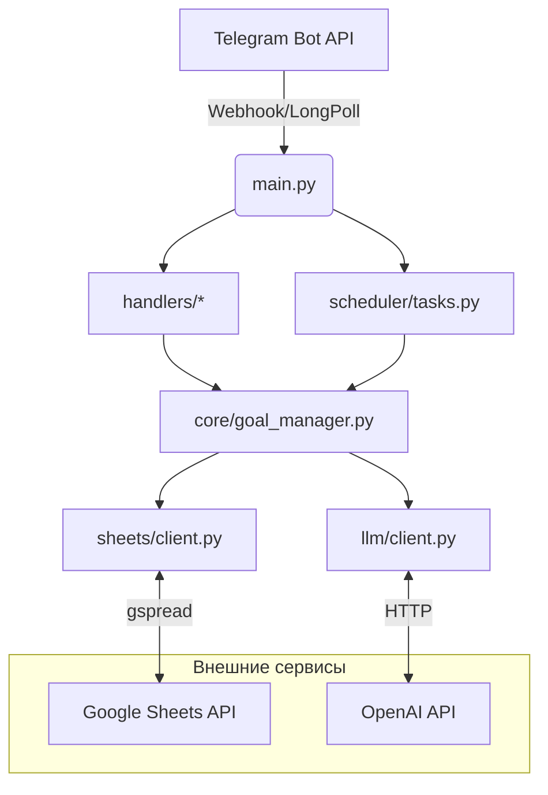

# Архитектура проекта

## Основные модули

| Каталог | Назначение |
|---------|------------|
| `main.py` | Точка входа, инициализация зависимостей и Telegram-бота |
| `handlers/` | Telegram-команды и диалоги (PTB 20) |
| `core/goal_manager.py` | Бизнес-логика: постановка цели, получение задач, мотивации |
| `sheets/client.py` | Работа с Google Sheets через `gspread` и автоматическое форматирование |
| `llm/` | Запросы к OpenAI (генерация плана, мотивации) |
| `scheduler/` | Фоновые напоминания `apscheduler` (утро/вечер, мотивация) |
| `utils/` | Утилиты (форматирование дат, парсинг периода) |

## Поток данных
1. Пользователь отправляет `/setgoal` → диалог запрашивает параметры.
2. `GoalManager.set_new_goal` генерирует план через LLM, формирует Google-таблицу.
3. `/today` или планировщик извлекают задачу на текущую дату.
4. `/check` обновляет статус задачи в таблице.

## Внешние зависимости
* Python ≥3.10
* Google Service Account JSON
* OpenAI API key

Сеть должна быть доступна к `api.telegram.org`, `sheets.googleapis.com`, `api.openai.com`. 