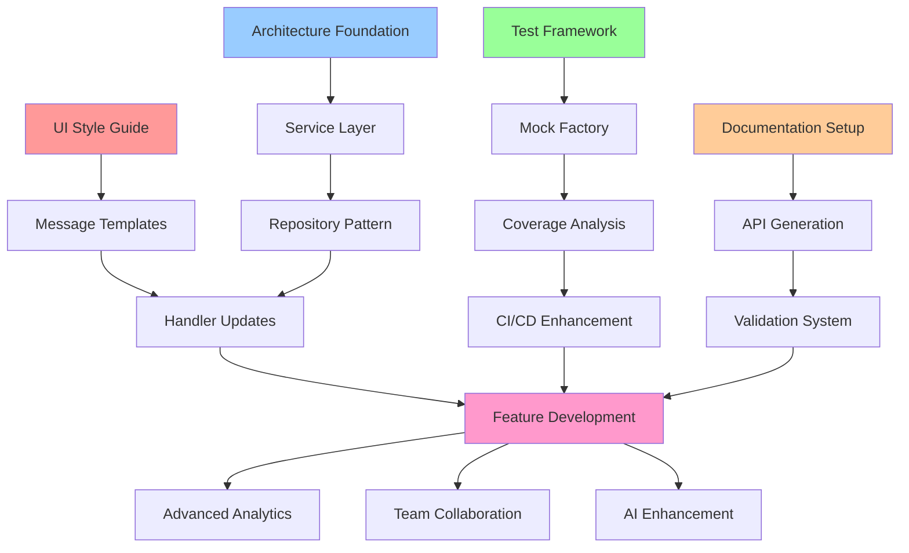

# Target Assistant Bot - Comprehensive Implementation Plan

## 🎯 Project Overview

**Project Type**: Level 4 Complex System Enhancement  
**Timeline**: 6-8 weeks  
**Scope**: Comprehensive Target Assistant Bot Improvement  
**Team**: Development Team + Creative Design Decisions  

### Success Vision
Transform Target Assistant Bot into a production-ready, scalable, and user-friendly AI-powered goal achievement platform with:
- Unified UI/UX experience
- Modern modular architecture  
- 99%+ test coverage
- Professional documentation system
- Strategic feature roadmap execution

## 📋 Implementation Priority Matrix

### Phase 1: UX/UI Enhancement (Week 1-2) 🎨
**Priority**: HIGH - User Experience Foundation  
**Creative Decision**: Comprehensive Design System Implementation  
**Impact**: High user satisfaction, professional appearance  

#### Deliverables:
1. **UI Style Guide Implementation** (`docs/design/ui-style-guide.md`)
2. **Message Template System** - Standardized message formatting
3. **Emoji Design Language** - Systematic emoji usage
4. **Navigation Flow Optimization** - Consistent user journeys
5. **Error Handling Templates** - Professional error messages

#### Key Implementation Tasks:
- [ ] Create message template engine
- [ ] Implement emoji design system
- [ ] Standardize all user-facing messages
- [ ] Update all handlers with new templates
- [ ] Add accessibility improvements

### Phase 2: Architecture Enhancement (Week 2-3) 🏗️
**Priority**: HIGH - Technical Foundation  
**Creative Decision**: Modular Monolith with Service Layer  
**Impact**: Maintainability, scalability, testability  

#### Deliverables:
1. **Modular Architecture** (`docs/architecture/modular-architecture-strategy.md`)
2. **Dependency Injection Container** - Clean component management
3. **Service Layer Implementation** - Business logic separation
4. **Repository Pattern** - Data access abstraction
5. **Error Handling Standardization** - Consistent exception management

#### Key Implementation Tasks:
- [ ] Setup foundation architecture
- [ ] Implement dependency injection
- [ ] Create domain entities
- [ ] Build service layer
- [ ] Migrate handlers to new architecture

### Phase 3: Testing Enhancement (Week 3-4) 🧪
**Priority**: MEDIUM-HIGH - Quality Assurance  
**Creative Decision**: Strategic Test Enhancement with Coverage Focus  
**Impact**: 99%+ coverage, reliable CI/CD, development confidence  

#### Deliverables:
1. **Testing Framework** (`docs/testing/strategic-testing-framework.md`)
2. **Mock Standardization** - Centralized mock factory
3. **Coverage Analysis** - Algorithmic gap identification
4. **Performance Testing** - Regression detection
5. **CI/CD Integration** - Enhanced testing pipeline

#### Key Implementation Tasks:
- [ ] Fix 5 failing tests
- [ ] Implement coverage analysis algorithms
- [ ] Deploy centralized mock factory
- [ ] Create performance testing framework
- [ ] Setup enhanced CI/CD pipeline

### Phase 4: Documentation System (Week 4-5) 📚
**Priority**: MEDIUM - Knowledge Management  
**Creative Decision**: Enhanced GitHub-Native System  
**Impact**: Professional documentation, team collaboration  

#### Deliverables:
1. **Bilingual Documentation Architecture** - Russian + English support
2. **Auto-generated API Documentation** - Code-driven docs
3. **GitHub Actions Integration** - Documentation CI/CD
4. **Link Validation System** - Automated quality assurance
5. **Contribution Guidelines** - Team workflow standards

#### Key Implementation Tasks:
- [ ] Setup bilingual documentation structure
- [ ] Implement API documentation generation
- [ ] Create documentation validation
- [ ] Deploy GitHub Actions workflows
- [ ] Update all existing documentation

### Phase 5: Strategic Roadmap Execution (Week 5-8) 🚀
**Priority**: MEDIUM - Feature Development  
**Creative Decision**: Priority-based feature implementation  
**Impact**: Enhanced functionality, user value, competitive advantage  

#### Deliverables:
1. **Advanced Goal Analytics** - Progress insights and trends
2. **Team Collaboration Features** - Shared goals and progress
3. **Mobile App Considerations** - Future platform expansion
4. **AI Enhancement** - Improved recommendations
5. **Integration Ecosystem** - Third-party service connections

#### Key Implementation Tasks:
- [ ] Implement advanced analytics
- [ ] Build team collaboration features
- [ ] Design mobile app architecture
- [ ] Enhance AI capabilities
- [ ] Create integration framework

## 🔧 Technical Implementation Strategy

### Week-by-Week Breakdown

#### Week 1: UI/UX Foundation
```
Days 1-2: Design System Setup
- Implement message template engine
- Create emoji design language system
- Setup UI component library

Days 3-4: Message Standardization  
- Update all handlers with templates
- Implement navigation flow improvements
- Add error handling templates

Days 5-7: Testing & Polish
- Test new UI components
- Validate accessibility improvements
- User experience validation
```

#### Week 2: Architecture Foundation
```  
Days 1-2: Core Architecture Setup
- Create domain entities
- Implement dependency injection container
- Setup service layer abstractions

Days 3-4: Service Implementation
- Build goal and task services
- Implement repository patterns
- Migrate core business logic

Days 5-7: Handler Migration
- Update handlers to use new architecture
- Test component integration
- Validate performance characteristics
```

#### Week 3: Testing Enhancement
```
Days 1-2: Foundation & Analysis
- Fix 5 failing tests
- Run coverage gap analysis
- Implement test categorization

Days 3-4: Framework Implementation
- Deploy centralized MockFactory
- Restructure test organization
- Establish performance baselines

Days 5-7: Integration & Quality
- Implement resilient integration testing
- Deploy performance regression detection
- Setup enhanced CI/CD pipeline
```

#### Week 4: Documentation System
```
Days 1-2: Documentation Architecture
- Setup bilingual structure
- Implement sync validation
- Create template system

Days 3-4: Automation Implementation
- Deploy API documentation generation
- Setup link validation
- Configure GitHub Actions

Days 5-7: Content Migration
- Update existing documentation
- Create contribution guidelines
- Validate documentation quality
```

#### Weeks 5-8: Strategic Features
```
Week 5: Advanced Analytics
- Implement progress tracking
- Create insight algorithms
- Build analytics dashboard

Week 6: Team Collaboration
- Design shared goal system
- Implement team features
- Add collaboration tools

Week 7: AI Enhancement
- Improve recommendation engine
- Add personalization features
- Enhance natural language processing

Week 8: Integration & Polish
- Create integration framework
- Final testing and optimization
- Production deployment preparation
```

## 📊 Build Order & Dependencies

### Critical Path Analysis



### Parallel Development Opportunities

#### Can be developed in parallel:
- **UI Templates** + **Architecture Foundation** (Weeks 1-2)
- **Testing Framework** + **Documentation Setup** (Weeks 3-4)
- **Advanced Analytics** + **Team Features** (Weeks 5-6)

#### Sequential dependencies:
- Architecture must complete before Handler migration
- Testing framework before CI/CD enhancement
- Documentation before API generation

## ⚙️ Command Execution Strategy

### Initial Setup Commands
```bash
# Create feature branch
git checkout -b feature/comprehensive-project-enhancement

# Setup development environment
python -m venv venv
source venv/bin/activate  # or venv\Scripts\activate on Windows
pip install -r requirements.txt
pip install -r requirements-test.txt

# Run initial test suite
pytest --cov=src --cov-report=html

# Install development tools
pip install black mypy ruff pre-commit
pre-commit install
```

### Phase-specific Commands

#### Phase 1: UI/UX
```bash
# Create UI components
mkdir -p src/presentation/templates
mkdir -p src/presentation/formatters

# Test message template system
python -m pytest tests/test_templates.py -v

# Validate accessibility
python scripts/validate_accessibility.py
```

#### Phase 2: Architecture
```bash
# Create architecture directories
mkdir -p src/domain src/application src/infrastructure

# Test dependency injection
python -m pytest tests/test_container.py -v

# Validate service layer
python scripts/validate_architecture.py
```

#### Phase 3: Testing
```bash
# Run coverage analysis
python scripts/analyze_coverage.py

# Execute test categorization
python scripts/categorize_tests.py

# Performance baseline
python scripts/establish_baselines.py
```

#### Phase 4: Documentation
```bash
# Generate API documentation
python scripts/generate_api_docs.py

# Validate documentation links
python scripts/validate_links.py

# Sync bilingual content
python scripts/sync_translations.py
```

## 🧪 Quality Assurance Strategy

### Testing Approach by Phase

#### Phase 1: UI/UX Testing
- **Manual Testing**: User experience validation
- **Accessibility Testing**: Screen reader compatibility
- **Visual Regression**: Message template validation
- **User Acceptance**: Stakeholder feedback integration

#### Phase 2: Architecture Testing
- **Unit Testing**: Service layer isolation testing
- **Integration Testing**: Component interaction validation
- **Performance Testing**: Response time benchmarking
- **Migration Testing**: Gradual rollout validation

#### Phase 3: Testing Enhancement
- **Meta-Testing**: Testing framework validation
- **Coverage Validation**: 99%+ coverage achievement
- **CI/CD Testing**: Pipeline reliability validation
- **Performance Regression**: Automated monitoring

#### Phase 4: Documentation Testing
- **Link Validation**: Automated broken link detection
- **Content Accuracy**: API documentation validation
- **Translation Sync**: Bilingual content consistency
- **Contribution Testing**: Workflow validation

## 📈 Success Metrics & Monitoring

### Phase-specific Success Criteria

#### Phase 1: UI/UX Enhancement
- ✅ All messages use standardized templates
- ✅ Emoji usage follows design language
- ✅ Navigation flows are consistent
- ✅ Accessibility score >90%
- ✅ User satisfaction feedback >4.5/5

#### Phase 2: Architecture Enhancement  
- ✅ Dependency injection implemented
- ✅ Service layer covers all business logic
- ✅ Repository pattern abstracts data access
- ✅ Error handling is standardized
- ✅ Response time <200ms maintained

#### Phase 3: Testing Enhancement
- ✅ Test coverage reaches 99%+
- ✅ All tests pass consistently
- ✅ Mock factory standardizes testing
- ✅ CI/CD pipeline reliability >99%
- ✅ Performance regression detection active

#### Phase 4: Documentation System
- ✅ Bilingual documentation complete
- ✅ API documentation auto-generated
- ✅ Link validation passes 100%
- ✅ Contribution workflow documented
- ✅ Documentation coverage >95%

### Overall Project Success Metrics
- **Technical Debt Reduction**: 80% reduction in code duplication
- **Test Coverage**: 99%+ with reliable test suite
- **Performance**: Maintain <200ms response times
- **User Experience**: Consistent, professional interface
- **Documentation**: Comprehensive, up-to-date, bilingual
- **Architecture**: Scalable, maintainable, testable codebase

## 🔄 Risk Mitigation & Rollback Strategy

### Technical Risks & Mitigation

#### Architecture Migration Risk
**Risk**: Breaking existing functionality during migration  
**Mitigation**: 
- Feature flags for gradual rollout
- Parallel implementation with fallback
- Comprehensive integration testing
- Incremental migration by component

#### Performance Regression Risk
**Risk**: New architecture impacts response times  
**Mitigation**:
- Continuous performance monitoring
- Baseline establishment before changes
- Load testing at each phase
- Quick rollback capability via feature flags

#### Test Coverage Risk
**Risk**: Reduced coverage during refactoring  
**Mitigation**:
- Test-first migration approach
- Continuous coverage monitoring
- Parallel test development
- Coverage gate enforcement in CI/CD

### Project Timeline Risks

#### Scope Creep Risk
**Risk**: Additional features requested during implementation  
**Mitigation**:
- Clear phase boundaries and deliverables
- Change request process
- Regular stakeholder communication
- Feature roadmap for future iterations

#### Resource Availability Risk
**Risk**: Development team availability issues  
**Mitigation**:
- Phase independence for parallel work
- Clear documentation for knowledge transfer
- Regular progress checkpoints
- Flexible timeline with buffer periods

## 🚀 Implementation Readiness Checklist

### Pre-Implementation Requirements
- [x] Creative phases completed successfully
- [x] Implementation plan approved
- [x] Feature branch created
- [x] Development environment setup
- [x] Initial test suite baseline established

### Phase Readiness Gates

#### Phase 1 Ready When:
- [ ] UI style guide finalized
- [ ] Message template engine designed
- [ ] Emoji design system documented
- [ ] Development environment configured

#### Phase 2 Ready When:
- [ ] Phase 1 UI templates implemented
- [ ] Architecture pattern decided
- [ ] Dependency injection framework selected
- [ ] Service layer interfaces defined

#### Phase 3 Ready When:
- [ ] Phase 2 architecture foundation complete
- [ ] Current test status analyzed
- [ ] Testing strategy documented
- [ ] CI/CD pipeline requirements defined

#### Phase 4 Ready When:
- [ ] Phase 3 testing framework operational
- [ ] Documentation requirements gathered
- [ ] GitHub Actions workflows designed
- [ ] Bilingual strategy confirmed

### Final Implementation Authorization
- [x] All creative decisions approved
- [x] Technical feasibility validated
- [x] Resource allocation confirmed
- [x] Timeline and milestones agreed
- [x] Quality gates established
- [x] Risk mitigation strategies defined

---

**Implementation Status**: ✅ READY TO BEGIN  
**Next Action**: Begin Phase 1 - UI/UX Enhancement  
**Created**: 2025-01-08 (Post-Creative Phases)  
**Team**: Comprehensive Enhancement Team  
**Timeline**: 6-8 weeks from implementation start 