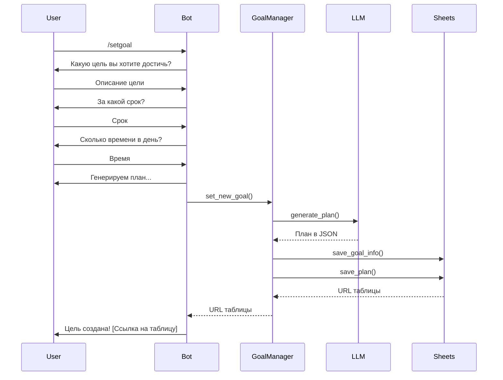

# План улучшения и развития проекта Target Assistant Bot

## Обзор проекта

Проект **Target Assistant Bot** представляет собой Telegram-бота для постановки целей, их разбивки на ежедневные задачи и отслеживания прогресса с хранением данных в Google Sheets. Проект имеет хорошую базовую архитектуру с разделением ответственности между модулями, но нуждается в улучшениях для повышения надежности, производительности и масштабируемости.

### Параметры эксплуатации

- **Целевая аудитория**: до 20 пользователей
- **Масштабирование**: планируется до 10 целей на пользователя
- **Хранение данных**: Google Sheets (без локального хранения)
- **Размещение**: виртуальное окружение Python или Docker

## 1. Асинхронность и устойчивость

### 1.1. Асинхронная обработка API

**Проблема**: Вызовы к Google Sheets и OpenAI блокируют основной поток, что снижает отзывчивость бота.

**Решение**:
```python
# Переработать core/goal_manager.py на async
class GoalManager:
    async def set_new_goal(self, user_id: int, goal_text: str, deadline_str: str,
                          available_time_str: str) -> str:
        # Асинхронные вызовы
        plan_json = await self.llm.generate_plan(goal_text, deadline_str, available_time_str)
        # ...
        spreadsheet_url = await self.sheets.save_goal_info(user_id, goal_info)
        await self.sheets.save_plan(user_id, full_plan)
        return spreadsheet_url
```

### 1.2. Асинхронный планировщик

**Проблема**: `BackgroundScheduler` работает в отдельном потоке, что может вызвать race conditions с `asyncio` в PTB 20+.

**Решение**:
```python
# scheduler/tasks.py
from apscheduler.schedulers.asyncio import AsyncIOScheduler

class Scheduler:
    def __init__(self, goal_manager, loop=None):
        self.goal_manager = goal_manager
        self.scheduler = AsyncIOScheduler(
            event_loop=loop,
            timezone=scheduler_cfg.timezone
        )
        
    async def add_user_jobs(self, bot: Bot, user_id: int):
        # Проверка существующих задач
        if self.scheduler.get_job(f"morning_{user_id}"):
            return  # Задачи уже добавлены
            
        # Добавление задач (как в оригинале)
        # ...
```

### 1.3. Улучшение механизмов повторных попыток

**Проблема**: Ручные реализации retry с `for` и `range` в `LLMClient._chat_completion`.

**Решение**:
```python
# llm/client.py
from tenacity import retry, wait_exponential_jitter, stop_after_attempt, retry_if_exception_type
from openai import RateLimitError, Timeout, APIError

RETRY = retry(
    retry=retry_if_exception_type((RateLimitError, Timeout, APIError)),
    wait=wait_exponential_jitter(initial=1, max=20),
    stop=stop_after_attempt(5),
)

class LLMClient:
    # ...
    
    @RETRY
    async def _chat_completion_async(self, prompt: str) -> str:
        # Существующий код но с async/await
        response = await self.client.chat.completions.create(
            model=self.model,
            messages=[{"role": "user", "content": prompt}],
            temperature=0.7,
        )
        return response.choices[0].message.content.strip()
```

### 1.4. Оптимизация работы с Google Sheets

**Проблема**: Sheets API имеет лимиты запросов, множественные одиночные запросы неэффективны.

**Решение**:
```python
# sheets/client.py
import gspread_asyncio
from google.oauth2.service_account import Credentials

class SheetsManager:
    def __init__(self):
        # ...
        self.agc = gspread_asyncio.AsyncioGspreadClientManager(self._get_credentials)
        
    def _get_credentials(self):
        return Credentials.from_service_account_file(
            google.credentials_path, 
            scopes=[
                "https://www.googleapis.com/auth/spreadsheets",
                "https://www.googleapis.com/auth/drive",
            ]
        )
    
    async def batch_update_task_statuses(self, user_id: int, updates: List[Dict]):
        """Пакетное обновление статусов задач."""
        client = await self.agc.authorize()
        spreadsheet = await client.open(f"TargetAssistant_{user_id}")
        worksheet = await spreadsheet.worksheet(PLAN_SHEET)
        
        # Подготовка batch-запроса
        batch_requests = []
        for update in updates:
            # Добавление update в batch
            # ...
            
        # Выполнение одного batch-запроса вместо множества одиночных
        await worksheet.batch_update(batch_requests)
```

## 2. Архитектурные улучшения

### 2.1. Интерфейсы и инверсия зависимостей

**Проблема**: `GoalManager` напрямую зависит от `SheetsManager` и `LLMClient`, что затрудняет тестирование и замену реализаций.

**Решение**:
```python
# storage/interface.py
from abc import ABC, abstractmethod
from typing import Dict, List, Any, Optional

class StorageInterface(ABC):
    @abstractmethod
    async def save_goal_info(self, user_id: int, goal_data: Dict[str, str]) -> str:
        """Сохраняет информацию о цели и возвращает URL."""
        pass
        
    # Другие методы...

# llm/interface.py
from abc import ABC, abstractmethod
from typing import List, Dict, Any

class LLMInterface(ABC):
    @abstractmethod
    async def generate_plan(self, goal_text: str, deadline: str, time: str) -> List[Dict[str, Any]]:
        """Генерирует план достижения цели."""
        pass
        
    # Другие методы...

# core/goal_manager.py
class GoalManager:
    def __init__(self, storage: StorageInterface, llm: LLMInterface):
        self.storage = storage
        self.llm = llm
        
    # Использование абстракций вместо конкретных классов
```

### 2.2. Типизированные DTO вместо словарей

**Проблема**: Использование словарей с "магическими строками" для передачи данных между модулями.

**Решение**:
```python
# models/goal.py
from dataclasses import dataclass
from datetime import datetime
from enum import StrEnum
from typing import List, Optional

class TaskStatus(StrEnum):
    NOT_DONE = "Не выполнено"
    DONE = "Выполнено"
    PARTIAL = "Частично выполнено"

@dataclass
class TaskItem:
    date: str
    day_of_week: str
    task: str
    status: TaskStatus = TaskStatus.NOT_DONE

@dataclass
class GoalInfo:
    text: str
    deadline: str
    daily_time: str
    start_date: str
    
# Использование в коде:
# goal_manager.py
def update_today_task_status(self, user_id: int, status: TaskStatus):
    # ...
```

### 2.3. Поддержка множественных целей

**Проблема**: Текущая архитектура предполагает одну цель на пользователя, планируется расширение до 10 целей.

**Решение**:
```python
# sheets/client.py
def _get_spreadsheet(self, user_id: int, goal_id: Optional[int] = None):
    """Получает или создает таблицу для пользователя.
    Если указан goal_id, возвращает листы для конкретной цели."""
    name = f"TargetAssistant_{user_id}"
    
    try:
        sh = self.gc.open(name)
        # Если указан goal_id, проверяем наличие листов
        if goal_id is not None:
            goal_sheet_name = f"{GOAL_INFO_SHEET}_{goal_id}"
            plan_sheet_name = f"{PLAN_SHEET}_{goal_id}"
            
            # Создаем листы, если их нет
            for sheet_name in (goal_sheet_name, plan_sheet_name):
                try:
                    sh.worksheet(sheet_name)
                except gspread.WorksheetNotFound:
                    sh.add_worksheet(
                        title=sheet_name, 
                        rows=10, 
                        cols=3 if sheet_name.startswith(GOAL_INFO_SHEET) else 4
                    )
    except gspread.SpreadsheetNotFound:
        # Создание таблицы
        # ...
        
    return sh

# Новые методы в GoalManager
async def get_user_goals(self, user_id: int) -> List[Dict[str, Any]]:
    """Возвращает список всех целей пользователя."""
    return await self.storage.get_user_goals(user_id)
    
async def set_active_goal(self, user_id: int, goal_id: int) -> None:
    """Устанавливает активную цель пользователя."""
    # ...
```

### 2.4. Кэширование запросов

**Проблема**: Частые одинаковые запросы к внешним API (Sheets, OpenAI) снижают производительность.

**Решение**:
```python
# utils/cache.py
from functools import lru_cache
import time
from typing import Any, Callable, TypeVar

T = TypeVar('T')

def timed_lru_cache(seconds: int, maxsize: int = 128):
    """LRU-кэш с ограничением времени жизни записей."""
    def wrapper_cache(func: Callable[..., T]) -> Callable[..., T]:
        func = lru_cache(maxsize=maxsize)(func)
        func.lifetime = seconds
        func.expiration = time.time() + func.lifetime

        def wrapped_func(*args, **kwargs) -> T:
            if time.time() > func.expiration:
                func.cache_clear()
                func.expiration = time.time() + func.lifetime
            return func(*args, **kwargs)

        return wrapped_func
    return wrapper_cache

# Применение в sheets/client.py
@timed_lru_cache(seconds=60*5)  # Кэш на 5 минут
async def get_task_for_date(self, user_id: int, goal_id: int, target_date: str):
    # ...
```

## 3. Улучшение надежности и отказоустойчивости

### 3.1. Защита от перегрузки API (Rate Limiting)

**Проблема**: Отсутствие контроля частоты запросов может привести к блокировке со стороны OpenAI или Google.

**Решение**:
```python
# utils/rate_limiter.py
from collections import defaultdict
import time
from typing import Dict, List

class RateLimiter:
    def __init__(self, max_calls: int, period: int):
        self.max_calls = max_calls  # Макс. количество вызовов
        self.period = period  # Период в секундах
        self.calls: Dict[int, List[float]] = defaultdict(list)  # user_id -> список временных меток
    
    def can_proceed(self, user_id: int) -> bool:
        now = time.time()
        # Удаляем старые вызовы
        self.calls[user_id] = [t for t in self.calls[user_id] if now - t < self.period]
        # Проверяем лимит
        if len(self.calls[user_id]) >= self.max_calls:
            return False
        # Добавляем текущий вызов
        self.calls[user_id].append(now)
        return True

# Применение в LLMClient
class LLMClient:
    def __init__(self):
        # ...
        self.rate_limiter = RateLimiter(max_calls=20, period=60)  # 20 запросов в минуту
        
    async def generate_plan(self, goal_text: str, deadline: str, time: str) -> List[Dict[str, Any]]:
        # Извлечение user_id из контекста или передача в параметрах
        user_id = self._extract_user_id_from_context()
        if not self.rate_limiter.can_proceed(user_id):
            raise RateLimitExceeded("Превышен лимит запросов к LLM")
        # ...
```

### 3.2. Улучшенная обработка ошибок

**Проблема**: Ошибки обрабатываются локально, но не всегда оптимально для конечного пользователя.

**Решение**:
```python
# core/exceptions.py
class BotError(Exception):
    """Базовый класс для ошибок в боте."""
    def __init__(self, message: str, user_friendly_message: str = None):
        super().__init__(message)
        self.user_friendly_message = user_friendly_message or "Произошла ошибка. Попробуйте позже."

class StorageError(BotError):
    """Ошибки работы с хранилищем."""
    pass

class LLMError(BotError):
    """Ошибки работы с LLM."""
    pass

# Обработчик ошибок
async def error_handler(update: Update, context: ContextTypes.DEFAULT_TYPE):
    """Глобальный обработчик ошибок."""
    error = context.error
    
    # Записываем ошибку в лог
    logger.error(f"Ошибка при обработке {update}: {error}", exc_info=context.error)
    
    # Извлекаем user-friendly сообщение
    if isinstance(error, BotError):
        user_message = error.user_friendly_message
    else:
        user_message = "Произошла непредвиденная ошибка. Команда уже работает над исправлением."
    
    # Отправляем сообщение пользователю
    if update.effective_chat:
        await context.bot.send_message(
            chat_id=update.effective_chat.id,
            text=user_message
        )
```

### 3.3. Резервное копирование данных

**Проблема**: Отсутствие защиты от потери данных в Google Sheets.

**Решение**:
```python
# sheets/client.py
async def backup_user_data(self, user_id: int) -> str:
    """Создает резервную копию Google Sheets пользователя."""
    client = await self.agc.authorize()
    sh = await client.open(f"TargetAssistant_{user_id}")
    backup_name = f"Backup_TargetAssistant_{user_id}_{datetime.now().strftime('%Y%m%d_%H%M')}"
    backup_sh = await client.copy(sh.id, title=backup_name)
    return backup_sh.url

# scheduler/tasks.py - добавить задачу на еженедельное резервное копирование
async def _backup_all_users(self, bot: Bot):
    """Создает резервные копии данных всех активных пользователей."""
    try:
        # Получаем список активных пользователей
        active_users = self.get_active_users()
        for user_id in active_users:
            await self.goal_manager.backup_user_data(user_id)
    except Exception as e:
        logger.error(f"Ошибка при создании резервных копий: {e}")
```

## 4. Улучшение пользовательского опыта

### 4.1. Визуализация прогресса

**Проблема**: Текущий вывод прогресса только числовой, без визуального представления.

**Решение**:
```python
# utils/helpers.py
def generate_progress_bar(completed: int, total: int, width: int = 10) -> str:
    """Создает визуальный прогресс-бар с заполненными/пустыми блоками."""
    filled = int(width * completed / total) if total > 0 else 0
    return "▓" * filled + "░" * (width - filled)

# handlers/task_management.py - модифицировать status()
async def status(update: Update, context: ContextTypes.DEFAULT_TYPE):
    data = await goal_manager.get_detailed_status(update.effective_user.id)
    # ...
    progress_bar = generate_progress_bar(data['completed_days'], data['total_days'], width=15)
    msg_lines.append(f"📊 *Прогресс*: {data['progress_percent']}% {progress_bar}")
    # ...
```

### 4.2. Интерактивные напоминания

**Проблема**: Напоминания статичные, требуют ручного ввода команд.

**Решение**:
```python
# scheduler/tasks.py - модифицировать _send_today_task
async def _send_today_task(self, bot: Bot, user_id: int):
    try:
        task = await self.goal_manager.get_today_task(user_id)
        if task:
            keyboard = InlineKeyboardMarkup([
                [InlineKeyboardButton("✅ Выполнено", callback_data="check:done")],
                [InlineKeyboardButton("🔄 Напомнить через 3 часа", callback_data="remind:3")]
            ])
            
            text = (
                f"📅 Задача на сегодня ({task.date}, {task.day_of_week}):\n\n"
                f"📝 {task.task}\n\nСтатус: {task.status.value}"
            )
            
            await bot.send_message(
                chat_id=user_id, 
                text=text, 
                reply_markup=keyboard
            )
        else:
            # ...
    except Exception as e:
        logger.error(f"Ошибка при отправке утренней задачи: {e}")
```

### 4.3. Улучшение интерфейса выбора целей

**Проблема**: При поддержке множественных целей нужен удобный интерфейс выбора.

**Решение**:
```python
# handlers/goal_selection.py
from telegram import Update, InlineKeyboardMarkup, InlineKeyboardButton
from telegram.ext import ContextTypes, CallbackQueryHandler

async def list_goals(update: Update, context: ContextTypes.DEFAULT_TYPE):
    """Показывает список целей пользователя и позволяет выбрать активную."""
    user_id = update.effective_user.id
    goals = await goal_manager.get_user_goals(user_id)
    
    if not goals:
        await update.message.reply_text("У вас пока нет ни одной цели. Используйте /setgoal для создания.")
        return
    
    keyboard = []
    for goal in goals:
        keyboard.append([InlineKeyboardButton(
            f"{goal.text} ({goal.progress}%)", 
            callback_data=f"select_goal:{goal.id}"
        )])
    
    keyboard.append([InlineKeyboardButton("🔄 Создать новую цель", callback_data="new_goal")])
    
    await update.message.reply_text(
        "Ваши текущие цели:",
        reply_markup=InlineKeyboardMarkup(keyboard)
    )
```

## 5. Улучшение тестирования и мониторинга

### 5.1. Модульные и интеграционные тесты

**Проблема**: Отсутствие автоматических тестов повышает риск регрессий.

**Решение**:
```python
# tests/test_goal_manager.py
import pytest
from unittest.mock import AsyncMock, MagicMock
from core.goal_manager import GoalManager
from models.goal import TaskStatus, TaskItem, GoalInfo

@pytest.fixture
def mock_storage():
    storage = AsyncMock()
    # Настройка мока
    storage.get_task_for_date.return_value = TaskItem(
        date="01.05.2025",
        day_of_week="Четверг",
        task="Тестовая задача",
        status=TaskStatus.NOT_DONE
    )
    return storage

@pytest.fixture
def mock_llm():
    llm = AsyncMock()
    # Настройка мока
    return llm

@pytest.fixture
def goal_manager(mock_storage, mock_llm):
    return GoalManager(mock_storage, mock_llm)

@pytest.mark.asyncio
async def test_get_today_task(goal_manager, mock_storage):
    # Arrange
    user_id = 123
    goal_id = 1
    
    # Act
    result = await goal_manager.get_today_task(user_id, goal_id)
    
    # Assert
    assert result.task == "Тестовая задача"
    assert result.status == TaskStatus.NOT_DONE
    mock_storage.get_task_for_date.assert_called_once()
```

### 5.2. Структурированное логирование

**Проблема**: Базовое логирование без контекста затрудняет диагностику.

**Решение**:
```python
# utils/logging.py
import structlog
import logging
from typing import Dict, Any, Optional

def setup_logging(log_level: str = "INFO"):
    """Настройка структурированного логирования."""
    logging.basicConfig(level=log_level)
    
    # Настройка structlog
    structlog.configure(
        processors=[
            structlog.contextvars.merge_contextvars,
            structlog.processors.add_log_level,
            structlog.processors.TimeStamper(fmt="iso"),
            structlog.dev.ConsoleRenderer()
        ],
        logger_factory=structlog.stdlib.LoggerFactory(),
    )
    
    return structlog.get_logger()

# Использование
# В обработчиках
logger = setup_logging()

async def start_handler(update: Update, context: ContextTypes.DEFAULT_TYPE):
    user_id = update.effective_user.id
    log = logger.bind(user_id=user_id, action="start")
    log.info("User started the bot")
    # ...
```

### 5.3. Мониторинг и сбор метрик

**Проблема**: Отсутствие мониторинга работы бота в продакшене.

**Решение**:
```python
# monitoring/metrics.py
from prometheus_client import Counter, Histogram, start_http_server
import time
from functools import wraps
from typing import Callable, Any

# Счетчики
COMMAND_COUNTER = Counter('bot_commands_total', 'Number of bot commands', ['command'])
ERROR_COUNTER = Counter('bot_errors_total', 'Number of errors', ['type'])

# Гистограммы
LLM_REQUEST_TIME = Histogram('llm_request_seconds', 'Time spent on LLM requests')
SHEETS_REQUEST_TIME = Histogram('sheets_request_seconds', 'Time spent on Google Sheets requests')

def init_metrics(port=8000):
    """Инициализирует HTTP-сервер для метрик Prometheus."""
    start_http_server(port)

def measure_time(metric: Histogram):
    """Декоратор для измерения времени выполнения функции."""
    def decorator(func: Callable) -> Callable:
        @wraps(func)
        async def wrapper(*args, **kwargs) -> Any:
            start_time = time.time()
            try:
                result = await func(*args, **kwargs)
                return result
            finally:
                metric.observe(time.time() - start_time)
        return wrapper
    return decorator

# Применение в llm/client.py
@measure_time(LLM_REQUEST_TIME)
async def generate_plan(self, goal_text: str, deadline: str, time: str) -> List[Dict[str, Any]]:
    # ...
```

## 6. Улучшения DevOps и развертывания

### 6.1. Оптимизированный Dockerfile

**Проблема**: Текущий контейнер может быть не оптимален по размеру и безопасности.

**Решение**:
```dockerfile
# Мульти-стадийная сборка для минимизации размера образа
FROM python:3.11-slim AS builder

WORKDIR /app
COPY requirements.txt .
RUN pip wheel --no-cache-dir --wheel-dir=/app/wheels -r requirements.txt

FROM python:3.11-slim
WORKDIR /app

# Копируем предварительно собранные пакеты
COPY --from=builder /app/wheels /app/wheels
COPY --from=builder /app/requirements.txt .
RUN pip install --no-cache-dir --no-index --find-links=/app/wheels -r requirements.txt

# Копируем исходный код
COPY . .

# Задаем переменные окружения по умолчанию
ENV PYTHONUNBUFFERED=1
ENV LOG_LEVEL=INFO

# Создаем непривилегированного пользователя
RUN useradd -m appuser
USER appuser

# Том для Google credentials
VOLUME ["/app/credentials"]
ENV GOOGLE_CREDENTIALS_PATH=/app/credentials/google_credentials.json

# Проверка здоровья контейнера
HEALTHCHECK --interval=30s --timeout=10s --start-period=5s --retries=3 \
    CMD python -c "import urllib.request; urllib.request.urlopen('http://localhost:8080/health')"

CMD ["python", "main.py"]
```

### 6.2. CI/CD конвейер

**Проблема**: Отсутствие автоматизации проверки качества и деплоя.

**Решение**:
```yaml
# .github/workflows/ci.yml
name: CI/CD Pipeline

on:
  push:
    branches: [ main ]
  pull_request:
    branches: [ main ]

jobs:
  lint:
    runs-on: ubuntu-latest
    steps:
      - uses: actions/checkout@v3
      - name: Set up Python
        uses: actions/setup-python@v4
        with:
          python-version: '3.11'
      - name: Install dependencies
        run: |
          python -m pip install --upgrade pip
          pip install ruff black mypy pytest
          if [ -f requirements.txt ]; then pip install -r requirements.txt; fi
      - name: Lint with ruff
        run: ruff check .
      - name: Check with black
        run: black --check .
      - name: Type check with mypy
        run: mypy .

  test:
    runs-on: ubuntu-latest
    needs: lint
    steps:
      - uses: actions/checkout@v3
      - name: Set up Python
        uses: actions/setup-python@v4
        with:
          python-version: '3.11'
      - name: Install dependencies
        run: |
          python -m pip install --upgrade pip
          pip install pytest pytest-asyncio pytest-cov
          if [ -f requirements.txt ]; then pip install -r requirements.txt; fi
      - name: Test with pytest
        run: pytest --cov=./ --cov-report=xml
      - name: Upload coverage to Codecov
        uses: codecov/codecov-action@v3

  build:
    runs-on: ubuntu-latest
    needs: test
    if: github.ref == 'refs/heads/main' && github.event_name == 'push'
    steps:
      - uses: actions/checkout@v3
      - name: Set up Docker Buildx
        uses: docker/setup-buildx-action@v2
      - name: Login to GitHub Container Registry
        uses: docker/login-action@v2
        with:
          registry: ghcr.io
          username: ${{ github.actor }}
          password: ${{ secrets.GITHUB_TOKEN }}
      - name: Build and push
        uses: docker/build-push-action@v4
        with:
          context: .
          push: true
          tags: ghcr.io/${{ github.repository }}:latest
```

### 6.3. Мониторинг и оповещения

**Проблема**: Отсутствие системы мониторинга и оповещений о проблемах.

**Решение**:
```python
# main.py - добавить интеграцию с Sentry
import sentry_sdk
from sentry_sdk.integrations.logging import LoggingIntegration

def setup_sentry():
    """Настройка Sentry для мониторинга ошибок."""
    sentry_dsn = os.getenv("SENTRY_DSN")
    if sentry_dsn:
        sentry_sdk.init(
            dsn=sentry_dsn,
            integrations=[LoggingIntegration(level=logging.INFO, event_level=logging.ERROR)],
            traces_sample_rate=0.2,
            send_default_pii=False,
        )

def main():
    # Инициализация Sentry
    setup_sentry()
    # ...
```

## 7. Улучшение документации

### 7.1. Подробная документация API

**Проблема**: Недостаточная документация публичных API проекта.

**Решение**:
```python
# Пример улучшения документации в core/goal_manager.py
class GoalManager:
    """Управляет бизнес-логикой целей пользователя.
    
    Этот класс отвечает за создание, обновление и получение 
    информации о целях пользователя, а также за генерацию планов
    и управление ежедневными задачами.
    
    Attributes:
        storage: Интерфейс хранилища данных
        llm: Интерфейс для работы с языковой моделью
    """
    
    async def set_new_goal(
        self,
        user_id: int,
        goal_text: str,
        deadline_str: str,
        available_time_str: str,
    ) -> str:
        """Создает новую цель пользователя с ежедневным планом.
        
        Args:
            user_id: Идентификатор пользователя Telegram
            goal_text: Текстовое описание цели
            deadline_str: Срок достижения цели (текст)
            available_time_str: Доступное ежедневное время (текст)
            
        Returns:
            str: URL-ссылка на таблицу с целью
            
        Raises:
            LLMError: При ошибке генерации плана
            StorageError: При ошибке сохранения в хранилище
        """
        # ...
```

### 7.2. Руководство пользователя

**Проблема**: Пустой файл `user_guide.md`.

**Решение**: Создать подробное руководство с примерами использования:

```markdown
# Руководство пользователя Target Assistant Bot

## Начало работы
1. **Поиск бота**: Найдите в Telegram бота по имени @TargetAssistantBot
2. **Запуск**: Отправьте команду `/start` для начала работы
3. **Справка**: Используйте `/help` для получения списка доступных команд

## Постановка цели
1. Отправьте команду `/setgoal`
2. Следуйте диалогу:
   - Опишите цель как можно подробнее
   - Укажите срок достижения (до 3 месяцев)
   - Укажите время, которое готовы уделять ежедневно
3. Бот сгенерирует план и сохранит его в Google Sheets

## Ежедневные задачи
1. Утром бот автоматически отправит задачу на текущий день
2. Вы также можете запросить её командой `/today`
3. Вечером бот напомнит отметить прогресс
4. Используйте `/check` для отметки выполнения задачи

## Отслеживание прогресса
1. Используйте `/status` для просмотра статистики
2. Для дополнительной мотивации используйте `/motivation`

## Сброс и перезапуск
Если хотите начать заново, используйте `/reset`

## Примеры целей
### Изучение нового языка
**Цель**: Выучить испанский до уровня А1
**Срок**: 2 месяца
**Время**: 30 минут в день

### Спортивная цель
**Цель**: Пробежать полумарафон
**Срок**: 8 недель
**Время**: 1 час в день
```

### 7.3. Документация архитектуры

**Проблема**: Базовая документация архитектуры может быть расширена.

**Решение**: Добавить более подробные диаграммы и описания:



## 8. План внедрения улучшений

### Фаза 1: Базовые улучшения (1-2 недели)
1. Асинхронный режим работы для API вызовов
2. Структурированное логирование
3. Улучшение обработки ошибок
4. Обновление документации

### Фаза 2: Архитектурные улучшения (2-3 недели)
1. Типизированные модели данных
2. Интерфейсы и инверсия зависимостей
3. Кэширование и оптимизация запросов
4. Написание базовых тестов

### Фаза 3: Расширенная функциональность (3-4 недели)
1. Поддержка множественных целей
2. Визуализация прогресса
3. Интерактивные напоминания
4. Система мониторинга

### Фаза 4: Оптимизация развертывания (1-2 недели)
1. Оптимизация Docker-образа
2. Настройка CI/CD
3. Интеграция с системой мониторинга ошибок
4. Документация по развертыванию

## Заключение

Предложенные улучшения помогут сделать Target Assistant Bot более надежным, производительным и масштабируемым. Особое внимание уделяется асинхронной работе с внешними API, типизации данных, тестированию и документации. Все улучшения организованы в поэтапный план, который позволит постепенно внедрять изменения без нарушения существующей функциональности.
